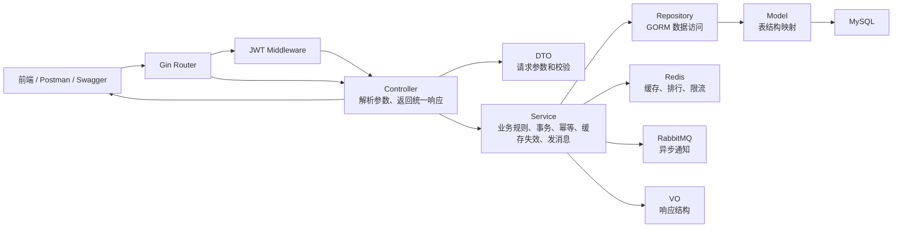
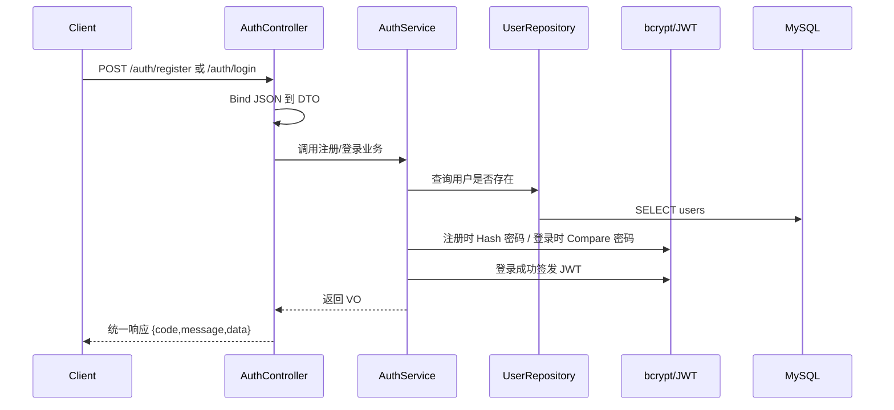
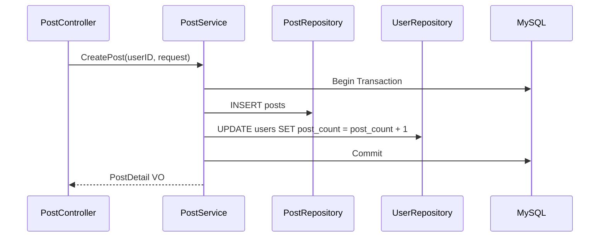
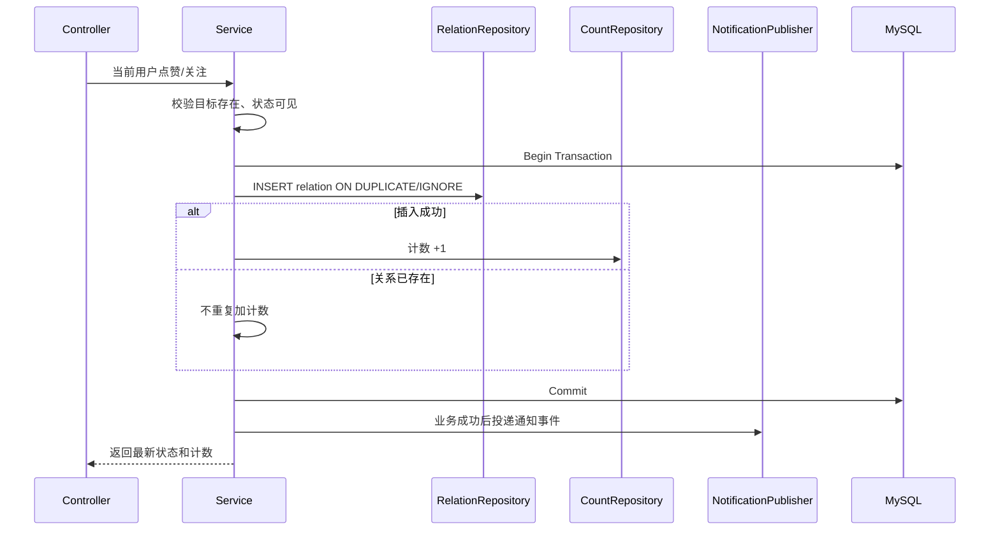
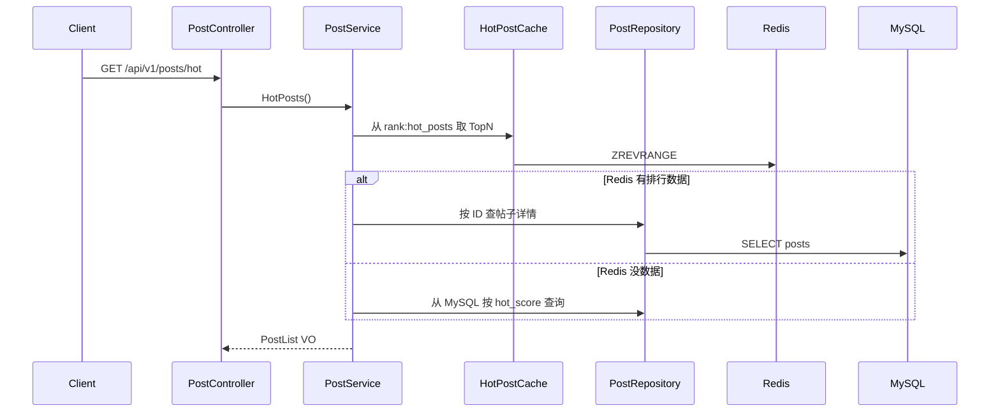
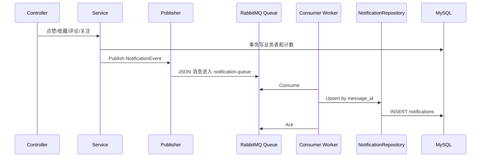

# FeedLab 面试讲解路线图

这份文档不是源码逐行解释，而是帮你把 FeedLab 讲成一个“实习展示项目”。面试官通常不只问“你做了什么”，还会继续追问：

- 为什么这样分层？
- 为什么要用事务？
- Redis 具体缓存了什么？怎么失效？
- RabbitMQ 解决了什么问题？
- 如果并发重复点赞怎么办？
- 这个项目和普通 CRUD 有什么区别？

你可以把这份文档当作复习路线：先背熟项目主线，再按调用链理解代码，最后用自己的话回答追问。

## 1. 项目定位

### 30 秒介绍

FeedLab 是我用 Go + Gin + GORM 做的内容社区后端项目，功能从用户注册登录、JWT 鉴权、帖子发布开始，逐步扩展到点赞、收藏、评论、关注、Redis 缓存、热门 Feed、RabbitMQ 异步通知和 React 展示前端。项目采用 Controller-Service-Repository 分层，核心业务都考虑了事务、幂等、软删除、缓存失效和消息消费幂等，目标是展示一个真实社区系统从基础业务到性能优化和异步化的演进过程。

### 2 分钟介绍

FeedLab 是一个内容社区系统，我按版本逐步迭代。

V1 先完成基础业务闭环：用户注册登录、bcrypt 密码加密、JWT 鉴权、帖子发布、列表、详情和软删除。这里重点是标准 Go 项目结构和 Controller-Service-Repository 分层。

V2 做互动系统，包括点赞、收藏、评论、评论点赞、关注和用户公开主页。这个阶段重点是关系表唯一索引、接口幂等和事务计数维护。例如点赞接口重复请求不会重复增加 `like_count`，关注接口会同时维护关注者的 `following_count` 和被关注者的 `follower_count`。

V3 引入 Redis，用于帖子详情缓存、用户公开资料缓存、评论列表缓存、热门帖子 ZSet、浏览量计数和登录限流。这里重点不是“用了 Redis”，而是具体说明每个 Key 的用途、TTL、失效时机以及如何避免缓存穿透。

V4 接入 RabbitMQ 做异步通知。点赞、收藏、评论、关注等操作在业务成功后投递通知事件，由 Worker 消费后写入 `notifications` 表。消费端用稳定 `message_id` 做幂等，避免重复消息导致重复通知。

V5 做展示型前端和 Demo Seed。前端使用 React Router 和 GSAP 做展示页面，后端提供 seed 脚本一键生成演示账号、帖子、互动关系和通知数据，方便面试时快速演示完整效果。

## 2. 总体架构怎么讲

一句话版本：

```text
Controller 处理 HTTP，Service 处理业务规则，Repository 处理数据库，Model 映射表结构，DTO/VO 隔离请求和响应。
```

完整请求流：



面试表达：

> 我把 HTTP 层和业务层拆开，是为了避免 Controller 变成大杂烩。Controller 只负责绑定参数、取当前用户和统一响应；Service 才决定能不能点赞、要不要开事务、要不要删缓存、要不要发通知；Repository 只封装 GORM 查询。这样后续加 Redis、RabbitMQ 或测试业务逻辑时，不需要把 HTTP 细节带进去。

## 3. V1 基础闭环

### 你要讲清楚什么

| 能力 | 面试重点 |
|---|---|
| 注册 | 唯一邮箱/用户名、bcrypt 存储密码哈希 |
| 登录 | 校验密码后签发 JWT |
| JWT 中间件 | 从 `Authorization: Bearer token` 解析用户身份 |
| 发帖 | 登录后创建帖子，并维护 `users.post_count` |
| 删帖 | 作者或 admin 才能软删除 |
| 统一响应 | 前端和 Postman 都按同一结构处理成功/失败 |

### 注册/登录调用链



### 发帖/删帖事务调用链



删除帖子也是同样思路：先校验帖子存在和权限，再在事务里软删除帖子，并扣减作者 `post_count`。

### 面试官可能追问

**Q：为什么密码用 bcrypt，不直接用 MD5？**

A：bcrypt 是专门为密码存储设计的慢哈希算法，带盐并且计算成本可调。密码校验不需要反解，只需要把用户输入和数据库里的哈希做比较。MD5 太快，容易被撞库和暴力破解。

**Q：为什么要软删除帖子？**

A：社区内容一般需要审计、恢复和后台管理。软删除只是写入 `deleted_at`，业务查询默认过滤掉，数据还在数据库里，后续可以做申诉、恢复或数据分析。

**Q：为什么发帖要事务？**

A：发帖不是只写 `posts`，还要更新 `users.post_count`。如果帖子插入成功但计数更新失败，就会出现数据不一致。事务保证两个操作要么都成功，要么都回滚。

## 4. V2 互动系统

### 你要讲清楚什么

V2 的核心不是“做了点赞收藏评论关注”，而是：

```text
关系表 + 唯一索引 + 幂等接口 + 事务计数维护
```

| 模块 | 关系表 | 幂等点 | 计数字段 |
|---|---|---|---|
| 点赞 | `post_likes` | 重复点赞不重复加数 | `posts.like_count` |
| 收藏 | `post_collects` | 重复收藏不重复加数 | `posts.collect_count` |
| 关注 | `user_follows` | 重复关注不重复加数 | `users.follower_count` / `following_count` |
| 评论 | `comments` | 删除一级评论要处理回复 | `posts.comment_count` |
| 评论点赞 | `comment_likes` | 重复点赞不重复加数 | `comments.like_count` |

### 点赞/关注幂等调用链



### 面试表达

> 点赞、收藏、关注都属于可重复触发的接口，所以我没有把重复点赞当成错误，而是做成幂等。数据库层用唯一索引兜底，业务层根据插入是否真的成功来决定是否增加计数。这样即使用户连续点击按钮，或者网络重试，也不会把计数刷爆。

### 面试官可能追问

**Q：为什么重复点赞不返回 409？**

A：从产品和接口设计看，点赞按钮表达的是“我要处于已点赞状态”，不是“我要插入一条记录”。所以重复请求返回成功更友好，也方便前端重试。

**Q：为什么取消点赞是物理删除，不软删除？**

A：点赞关系本身是用户当前状态，取消后再次点赞可以重新插入。这个场景对审计要求不强，如果做软删除会让唯一索引和查询逻辑更复杂。真正需要审计时可以再加操作日志表。

**Q：关注为什么要禁止关注自己？**

A：关注是两个用户之间的关系，自我关注没有业务意义，还会污染粉丝数和关注数，所以 Service 层要显式拦截。

## 5. V3 Redis 缓存和 Feed

### Redis Key 怎么讲

| Key | 类型 | 用途 | TTL/策略 |
|---|---|---|---|
| `post:detail:{id}` | String JSON | 帖子详情缓存 | 几分钟级 TTL，帖子变更/互动后删除 |
| `post:detail:null:{id}` | String | 空值缓存，防穿透 | 短 TTL |
| `user:profile:{id}` | String JSON | 用户公开资料缓存 | 中等 TTL，用户计数变化后删除 |
| `rank:hot_posts` | ZSet | 热门帖子排行榜 | 常驻，互动后刷新分数 |
| `post:view:{id}` | String counter | 浏览量增量计数 | 达阈值后刷回 MySQL |
| `post:comments:{id}:page:{page}:size:{size}` | String JSON | 评论列表缓存 | 评论新增/删除后失效 |
| 登录限流 Key | String counter | 限制登录失败/频率 | 窗口期 TTL |

### Redis 热门 Feed 调用链



### 缓存一致性怎么讲

> 我没有追求强一致缓存，而是采用社区项目常见的最终一致性。帖子详情、用户资料和评论列表都是读多写少数据，读的时候先查 Redis，未命中再查 MySQL 并回填；写操作成功后删除相关缓存，让下一次读取重新从数据库构建。计数字段如浏览量用 Redis 做增量计数，达到阈值再刷回 MySQL，减少频繁写库。

### 面试官可能追问

**Q：缓存穿透是什么？你怎么处理？**

A：缓存穿透是大量请求查询不存在的数据，导致每次都打到数据库。我给不存在的帖子详情写一个短 TTL 的空值缓存，例如 `post:detail:null:{id}`，下次请求同一个不存在 ID 时直接从 Redis 判断，不再频繁查库。

**Q：为什么热门榜用 ZSet？**

A：ZSet 天然适合排行榜，member 是帖子 ID，score 是热度分。获取热门帖子可以用 `ZREVRANGE` 按分数倒序取 TopN，比每次从 MySQL 排序更适合高频访问。

**Q：为什么浏览量不每次直接更新 MySQL？**

A：浏览量是高频写，如果每次访问都 `UPDATE posts SET view_count = view_count + 1`，数据库压力会很大。用 Redis 先累加，到阈值再刷回 MySQL，可以把大量小写合并成少量批量写。

## 6. V4 RabbitMQ 异步通知

### 你要讲清楚什么

RabbitMQ 不是为了炫技，而是把“主业务成功”和“通知写入”解耦：

```text
用户点赞成功应该优先保证点赞关系和计数正确，通知可以异步写。
```

### RabbitMQ 通知调用链



### 消息格式怎么讲

通知事件包含这些核心字段：

| 字段 | 含义 |
|---|---|
| `message_id` | 幂等 ID，防止重复消息写重复通知 |
| `type` | 通知类型，如 `post_like`、`comment`、`follow` |
| `recipient_id` | 接收通知的用户 |
| `actor_id` | 触发动作的用户 |
| `subject_type` / `subject_id` | 通知主体，如帖子、评论、用户 |
| `post_id` / `comment_id` | 方便前端跳转 |
| `content` | 展示摘要 |

### 面试表达

> 我在 Service 里先完成主业务事务，事务成功后再发布通知事件。Consumer 消费消息时用 `message_id` 做唯一约束或 upsert，这样 RabbitMQ 即使因为网络或 ack 问题投递重复消息，也不会产生重复通知。这个设计体现的是异步解耦和消费端幂等。

### 面试官可能追问

**Q：为什么不在点赞接口里直接写通知表？**

A：直接写也可以，但通知不是点赞的核心路径。如果通知写入慢或失败，不应该影响用户点赞成功。异步化后，主接口响应更稳定，通知可以由 Worker 重试或单独排查。

**Q：如果消息发送失败怎么办？**

A：当前项目是实习展示版本，主链路先保证业务表一致。生产环境可以进一步引入 outbox 表：业务事务里同时写事件表，再由后台任务可靠投递到 RabbitMQ，避免事务成功但消息发送失败。

**Q：为什么 Consumer 要做幂等？**

A：消息队列通常是至少一次投递，重复消费是正常可能。用稳定 `message_id` 做唯一约束，可以保证同一事件重复消费也只写一条通知。

## 7. V5 展示前端和 Demo Seed

### 你要讲清楚什么

V5 的价值是“让项目可展示”：

- React Router 把总览、Feed、通知、用户主页、系统驾驶舱拆成独立页面。
- GSAP 做进入动画和动效，提升展示观感。
- Demo Seed 幂等生成演示账号、帖子、互动关系、热门分和通知。
- 前端一键登录配合 seed，减少面试现场手动造数据。

### Demo Seed 怎么讲

> 我做了一个 Go CLI seed 脚本，而不是写 SQL 文件。原因是项目已经有 GORM model、bcrypt、缓存和通知结构，用 Go seed 可以复用这些结构，生成密码哈希、互动关系和计数时更贴近真实业务。脚本是幂等的，重复运行不会清空全库，也不会重复刷爆计数，只会补齐演示数据并重新计算统计字段。

### 面试官可能追问

**Q：为什么做前端？你不是后端项目吗？**

A：核心仍然是后端，但找实习展示时，只给接口文档不够直观。前端是为了把 Feed、通知、用户主页和缓存效果展示出来，让面试官更快看到业务闭环。

**Q：Demo Seed 为什么不清空数据库？**

A：清空全库风险太高，尤其后续部署到 VPS 后可能误删已有测试数据。幂等补齐更安全，也更接近真实工程里的初始化脚本。

## 8. 高频追问速答

### 分层相关

**Q：Controller、Service、Repository 分别做什么？**

A：Controller 负责 HTTP，包括参数绑定、路径参数、当前登录用户和统一响应；Service 负责业务规则，包括权限、事务、幂等、缓存失效和消息投递；Repository 负责 GORM 查询和数据库更新。

**Q：DTO 和 VO 为什么要分开？**

A：DTO 面向请求入参，VO 面向响应出参。这样数据库字段不会直接暴露给前端，例如 `password_hash`、`role` 等内部字段不会出现在公开响应里。

### 数据一致性相关

**Q：哪些地方用了事务？**

A：凡是涉及多个表或关系表加计数字段的地方都用事务，比如发帖同时更新用户发帖数，点赞同时写点赞关系和帖子点赞数，关注同时写关注关系并更新两个用户的计数。

**Q：计数会不会不准？**

A：核心写操作在事务里同步维护计数，Redis 浏览量这类高频计数允许最终一致。Demo Seed 也提供了重新计算计数的能力，方便演示环境修正数据。

### Redis 相关

**Q：Redis 宕机怎么办？**

A：当前健康检查会暴露 Redis 状态。业务上缓存应该是加速层，不应该成为唯一数据源；帖子、用户、评论最终都以 MySQL 为准。生产环境还可以加降级逻辑，Redis 异常时直接走 MySQL。

**Q：缓存更新为什么用删除，不直接更新？**

A：删除缓存更简单可靠。写操作成功后删缓存，下次读时从 MySQL 重建，避免多个写路径都要维护复杂的缓存更新逻辑。

### RabbitMQ 相关

**Q：RabbitMQ 和 Redis Pub/Sub 有什么区别？**

A：RabbitMQ 是消息队列，支持确认、重试、持久化等机制，适合异步通知这种需要可靠消费的场景。Redis Pub/Sub 更像实时广播，订阅者不在线时消息容易丢，不适合作为可靠通知链路。

### 项目展示相关

**Q：这个项目最大的亮点是什么？**

A：不是某一个技术点，而是按真实社区系统演进：先做基础业务，再做互动幂等和事务，再做 Redis 性能优化，再做 RabbitMQ 异步解耦，最后做前端和 seed 让项目可演示。

**Q：如果继续优化，你会做什么？**

A：我会先做生产部署，包括 Dockerfile、生产 Compose、Nginx/Caddy、环境变量和 HTTPS；然后完善监控日志、引入 outbox 保证消息可靠投递，再补充更多集成测试和压测。

## 9. 推荐复习顺序

1. 先读本文，能完整讲出 V1-V5 的主线。
2. 再读 [V1 架构源码导读](./feedlab-v1-architecture-guide.md)，理解最基础的分层。
3. 再读 [V2 互动系统代码导读](./feedlab-v2-interactions-code-guide.md)，重点看事务和幂等。
4. 再读 [V3 Redis 与缓存系统代码导读](./feedlab-v3-redis-cache-guide.md)，把 Key、TTL、失效策略说清楚。
5. 再读 [V4 RabbitMQ 异步通知导读](./feedlab-v4-rabbitmq-notifications-guide.md)，把消息幂等和异步解耦说清楚。
6. 最后打开前端和 Swagger，用 Demo Seed 演示一遍完整流程。

## 10. 自测题

你可以先不看答案，自己口头回答：

1. FeedLab 为什么要用 Controller-Service-Repository 分层？
2. 登录成功后 JWT 是在哪里生成、在哪里解析的？
3. 发帖为什么需要事务？
4. 点赞接口为什么要做幂等？
5. `post_likes` 为什么要唯一索引？
6. 删除一级评论时为什么要同时处理回复？
7. Redis 帖子详情缓存什么时候写入，什么时候删除？
8. 热门榜为什么适合用 ZSet？
9. 空值缓存解决什么问题？
10. RabbitMQ 通知为什么要用 `message_id`？
11. Consumer 为什么要做幂等？
12. Demo Seed 为什么要幂等，而不是每次清空数据库？

如果你能用自己的话讲清楚这 12 个问题，这个项目在实习面试里的基本盘就稳了。
