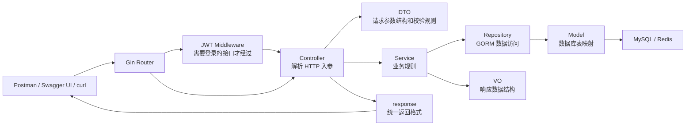

# FeedLab Go V1 架构源码导读

这份文档的目标不是替代 README，而是帮你站在“第一次做后端项目”的视角，把 FeedLab V1 每一层、每个 `.go` 文件之间的关系讲清楚。你可以把它当作面试前的项目讲解稿，也可以当作读代码路线图。

如果你想看更具体的代码块级解释，请读配套文档：[FeedLab Go V1 代码层逐段详解](./feedlab-v1-code-walkthrough.md)。那份文档会逐段拆 `main.go`、`router.go`、Controller、Service、Repository、Model、DTO、VO、中间件、JWT 和 bcrypt。

## V1 是否已经完成

按当前 V1 计划，FeedLab 后端主流程已经完成并跑通：

| 能力 | 状态 |
|---|---|
| Go + Gin 项目结构 | 已完成 |
| Controller-Service-Repository 分层 | 已完成 |
| `config.yaml` 配置 | 已完成 |
| MySQL + GORM | 已完成 |
| Redis 连接和健康检查 | 已完成 |
| 用户注册 | 已完成 |
| 用户登录 | 已完成 |
| bcrypt 密码哈希 | 已完成 |
| JWT 签发、解析和中间件鉴权 | 已完成 |
| 当前用户信息 `/users/me` | 已完成 |
| 发布帖子 | 已完成 |
| 帖子列表 | 已完成 |
| 帖子详情 | 已完成 |
| 帖子软删除 | 已完成 |
| 多表更新事务 | 已完成，发布和删除帖子都会维护 `users.post_count` |
| 统一响应格式 | 已完成 |
| Swagger UI 可测试接口 | 已完成 |
| Postman 测试流程 | 已完成 |
| 面试题网页 | 已完成并按模块维护 |

需要注意：Redis 业务缓存、RabbitMQ、评论、点赞、收藏、关注、Refresh Token、前端社区页面还不属于 V1。这些没有做不是缺失，而是按版本规划留给后续模块。

## 先建立整体图

一次 HTTP 请求大致这样流动：



最重要的一句话：

```text
Controller 负责 HTTP，Service 负责业务，Repository 负责数据库。
```

如果你面试时能围绕这句话展开，再结合注册、登录、发帖、删帖几个调用链，就能把项目讲得很清楚。

## 为什么要分层

### Controller 层

Controller 只关心 HTTP：

- 从 URL、Query、Header、Body 里取参数。
- 调用 Gin 的绑定和校验能力。
- 从 JWT 中间件写入的上下文中取 `user_id`、`role`。
- 调用 Service。
- 把 Service 的结果包装成统一响应。

Controller 不应该直接写 SQL，也不应该写复杂业务规则。比如“非作者不能删除帖子”这种业务规则放在 Service 更合适。

### Service 层

Service 只关心业务：

- 注册时检查用户名和邮箱是否重复。
- 登录时校验密码、用户状态、签发 Token。
- 发布帖子时创建 `posts`，并维护 `users.post_count`。
- 删除帖子时判断作者或 admin 权限，并执行软删除。
- 多表更新时开启事务。

Service 不应该关心请求是来自 curl、Postman 还是浏览器。这样以后换成 gRPC、消息消费或后台任务，业务逻辑仍然可以复用。

### Repository 层

Repository 只关心数据访问：

- 使用 GORM 查询、创建、更新、删除。
- 把 `gorm.ErrRecordNotFound` 转成项目自己的 `repository.ErrNotFound`。
- 提供事务版本的 Repository，例如 `WithTx(tx)`。

Repository 不应该知道 HTTP 状态码，也不应该知道前端需要什么 JSON 字段。

### DTO、VO、Model 的区别

这三个名字容易混，建议这样记：

| 类型 | 方向 | 用途 |
|---|---|---|
| DTO | 外部请求进入后端 | 描述请求参数，比如注册请求、发帖请求 |
| Model | 后端和数据库之间 | 描述数据库表结构，给 GORM 使用 |
| VO | 后端返回给外部 | 描述响应数据，避免把数据库敏感字段直接返回 |

举例：`users` 表里有 `password_hash`，Model 必须有这个字段，因为数据库要存；但 VO 不能返回它，所以 `vo.User` 里没有 `PasswordHash`。

## 启动过程

入口文件是 `backend/cmd/api/main.go`。

启动顺序：

1. 读取 `config.yaml`。
2. 初始化日志。
3. 连接 MySQL。
4. 执行 GORM AutoMigrate，创建或更新 `users`、`posts` 表。
5. 连接 Redis 并 `PING`。
6. 调用 `router.New(...)` 组装所有依赖和路由。
7. 启动 Gin HTTP 服务。
8. 监听 `SIGINT`、`SIGTERM`，支持按 Ctrl+C 退出。

这里体现了一个真实项目常见的依赖方向：

```text
main.go 创建底层依赖
router.go 把依赖装配成 Controller / Service / Repository
Controller 处理具体请求
```

## 主要业务调用链

### 注册接口

接口：

```text
POST /api/v1/auth/register
```

调用链：

```text
router.go
  -> AuthController.Register
  -> dto.RegisterRequest
  -> AuthService.Register
  -> UserRepository.ExistsByUsername
  -> UserRepository.ExistsByEmail
  -> password.Hash
  -> UserRepository.Create
  -> vo.NewUser
  -> response.Created
```

为什么这样设计：

- Controller 校验请求体格式。
- Service 负责“用户名/邮箱不能重复”和“密码必须哈希后保存”。
- Repository 负责实际写入 `users` 表。
- VO 负责把可展示的用户信息返回，避免返回密码哈希。

### 登录接口

接口：

```text
POST /api/v1/auth/login
```

调用链：

```text
router.go
  -> AuthController.Login
  -> dto.LoginRequest
  -> AuthService.Login
  -> UserRepository.FindByEmail
  -> password.Compare
  -> jwt.Manager.Generate
  -> vo.LoginResult
  -> response.Success
```

关键点：

- 数据库里不存明文密码，所以登录时不是“解密密码”，而是用 bcrypt 比较明文密码和哈希是否匹配。
- JWT 里放 `user_id` 和 `role`，后续接口通过中间件解析。

### 当前用户接口

接口：

```text
GET /api/v1/users/me
```

调用链：

```text
router.go
  -> AuthMiddleware.RequireAuth
  -> jwt.Manager.Parse
  -> gin.Context.Set("user_id", ...)
  -> UserController.Me
  -> middleware.CurrentUserID
  -> UserService.Me
  -> UserRepository.FindByID
  -> vo.NewUser
  -> response.Success
```

关键点：

- `users/me` 不是自己解析 Token，而是依赖中间件。
- 中间件把 Token 解析出来的用户信息放到 Gin 上下文里。
- Controller 从上下文取当前用户 ID。

### 发布帖子接口

接口：

```text
POST /api/v1/posts
```

调用链：

```text
router.go
  -> AuthMiddleware.RequireAuth
  -> PostController.Create
  -> dto.CreatePostRequest
  -> PostService.Create
  -> PostRepository.Transaction
      -> PostRepository.Create
      -> UserRepository.IncrementPostCount(+1)
  -> PostRepository.FindByID
  -> vo.NewPost
  -> response.Created
```

为什么需要事务：

- 发布帖子写入 `posts` 表。
- 如果帖子是 `published`，还要更新 `users.post_count`。
- 这是两个表的更新，要么都成功，要么都失败。

如果没有事务，可能出现帖子创建成功，但用户发帖数没加的脏状态。

### 帖子列表接口

接口：

```text
GET /api/v1/posts?page=1&page_size=10
```

调用链：

```text
PostController.List
  -> dto.ListPostsQuery
  -> PostService.List
  -> PostRepository.ListPublished
  -> Preload("User")
  -> vo.NewPosts
  -> response.Success
```

关键点：

- V1 只展示 `published` 帖子。
- GORM 默认过滤 `deleted_at IS NULL`，所以软删除的帖子不会出现在列表里。
- `Preload("User")` 会把作者用户信息一起查出来，方便 VO 组装 `author` 字段。

### 帖子详情接口

接口：

```text
GET /api/v1/posts/:id
```

调用链：

```text
PostController.Detail
  -> parseIDParam
  -> PostService.Detail
  -> PostRepository.FindPublishedByID
  -> Preload("User")
  -> vo.NewPost
  -> response.Success
```

关键点：

- `id` 必须是大于 0 的数字。
- 只查 `published`。
- 软删除后的帖子会返回 404。

### 删除帖子接口

接口：

```text
DELETE /api/v1/posts/:id
```

调用链：

```text
AuthMiddleware.RequireAuth
  -> PostController.Delete
  -> PostService.Delete
  -> PostRepository.FindByID
  -> 校验作者或 admin
  -> PostRepository.Transaction
      -> PostRepository.SoftDelete
      -> UserRepository.IncrementPostCount(-1)
  -> response.Success
```

为什么使用软删除：

- 不是物理删除行，而是写入 `deleted_at`。
- 普通 GORM 查询会默认过滤已删除数据。
- 后续后台审核、恢复、审计都能用到历史数据。

## 每个 Go 文件说明

### `cmd/api/main.go`

项目入口。它负责把程序跑起来，而不是写业务。

主要职责：

- 调用 `config.Load` 读取配置。
- 调用 `logger.New` 创建日志器。
- 调用 `db.NewMySQL` 连接 MySQL。
- 调用 `db.AutoMigrate` 初始化表结构。
- 调用 `db.NewRedis` 连接 Redis。
- 调用 `router.New` 创建 Gin Engine。
- 启动 HTTP 服务。

面试表达：

```text
main.go 是组合根，它负责创建底层依赖，并把依赖交给 router 装配。业务逻辑不会写在 main 里。
```

### `internal/config/config.go`

配置模块。它让端口、数据库账号、Redis 地址、JWT 密钥等信息从 `config.yaml` 读取，而不是写死在代码里。

主要结构：

- `Config`：总配置。
- `ServerConfig`：服务地址和 Gin 模式。
- `MySQLConfig`：MySQL 连接信息和连接池参数。
- `RedisConfig`：Redis 地址、密码、DB。
- `JWTConfig`：JWT 密钥、签发者、过期时间。
- `LogConfig`：日志级别。

核心函数：

- `Load(path string)`：读取 YAML 文件并填充默认值。
- `withDefaults()`：没有配置时使用默认值。
- `MySQLConfig.DSN()`：拼接 GORM MySQL 连接字符串。

### `internal/config/config_test.go`

测试配置读取。

它会临时创建一个 `config.yaml`，验证：

- 能正确读取配置。
- 没写的字段会补默认值，例如 `utf8mb4`、JWT 过期时间。

这个测试的意义是防止未来改配置结构时把启动流程弄坏。

### `internal/db/mysql.go`

MySQL 初始化文件。

主要职责：

- 用 GORM 打开 MySQL 连接。
- 获取底层 `sql.DB`。
- 设置连接池。
- 执行 `Ping`，确认数据库真的可用。

为什么要 `Ping`：

```text
gorm.Open 成功不一定代表数据库可用，Ping 才能尽早暴露账号、端口、网络问题。
```

### `internal/db/redis.go`

Redis 初始化文件。

主要职责：

- 创建 go-redis 客户端。
- 启动时 `PING` Redis。

V1 不使用业务 Redis Key，只检查 Redis 是否连得上。后续缓存帖子详情、用户信息、排行榜时再增加 Key 设计。

### `internal/db/migrate.go`

数据库迁移文件。

当前调用：

```go
mysql.AutoMigrate(&model.User{}, &model.Post{})
```

它会根据 GORM Model 创建或更新 `users`、`posts` 表。

V1 使用 AutoMigrate 是为了开发方便。真实生产项目通常会使用更严格的 migration 工具来管理表结构版本。

### `internal/logger/logger.go`

日志初始化文件。

主要职责：

- 根据配置设置日志级别。
- 使用 Go 标准库 `log/slog` 输出 JSON 日志。

JSON 日志方便以后接入日志采集系统，也方便排查线上问题。

### `internal/router/router.go`

路由和依赖装配中心。

它做了两件重要的事：

1. 注册 Gin 中间件和 HTTP 路由。
2. 把 Repository、Service、Controller 串起来。

装配关系：

```text
gorm.DB -> UserRepository -> AuthService -> AuthController
gorm.DB -> PostRepository -> PostService -> PostController
jwt.Manager -> AuthMiddleware
```

为什么依赖都在这里组装：

```text
这样每一层只依赖自己真正需要的对象，不需要全局变量，也更容易测试和扩展。
```

### `internal/controller/auth_controller.go`

认证 Controller。

包含接口：

- `Register`
- `Login`

主要职责：

- `ShouldBindJSON` 解析 JSON 请求体。
- 参数错误时返回 `40000`。
- 调用 `AuthService`。
- 调用 `writeServiceError` 把业务错误翻译成 HTTP 状态码和统一错误码。

`writeServiceError` 当前放在这个文件里，但被同一个 `controller` 包下的其他 Controller 复用。

### `internal/controller/user_controller.go`

用户 Controller。

包含接口：

- `Me`

主要职责：

- 从 JWT 中间件写入的 Gin 上下文里取 `user_id`。
- 调用 `UserService.Me` 查询用户。
- 返回统一响应。

这个接口是验证 JWT 鉴权链路的最小闭环。

### `internal/controller/post_controller.go`

帖子 Controller。

包含接口：

- `Create`
- `List`
- `Detail`
- `Delete`

主要职责：

- 解析请求体、query 参数、path 参数。
- 需要登录的接口读取当前用户 ID。
- 调用 `PostService`。
- 统一返回响应。

辅助函数：

- `parseIDParam`：把 URL 里的 `:id` 转成 `uint64`，并保证大于 0。

### `internal/controller/health_controller.go`

健康检查 Controller。

包含接口：

- `Health`

主要职责：

- 调用 `HealthService.Check`。
- 如果 MySQL 或 Redis 不可用，返回 `50000`。

健康检查不是只返回 API alive，因为 API 进程活着不代表业务可用。注册、登录、帖子都依赖 MySQL，后续缓存和排行榜依赖 Redis。

### `internal/middleware/auth.go`

JWT 鉴权中间件。

核心函数：

- `RequireAuth()`：返回一个 Gin 中间件。
- `CurrentUserID(c)`：从上下文取当前用户 ID。
- `CurrentRole(c)`：从上下文取当前用户角色。

执行流程：

1. 读取 `Authorization` Header。
2. 要求格式是 `Bearer <token>`。
3. 调用 `jwt.Manager.Parse` 验证签名、过期时间、issuer。
4. 把 `user_id`、`role` 写入 Gin 上下文。
5. 调用 `c.Next()` 放行。

如果失败，就调用 `c.Abort()` 阻止请求继续进入 Controller。

### `internal/response/response.go`

统一响应模块。

所有接口都返回：

```json
{
  "code": 0,
  "message": "success",
  "data": {}
}
```

核心函数：

- `Success`
- `Created`
- `Error`

统一响应的好处：

- 前端可以固定判断 `code`。
- Postman 和 Swagger 测试结果更一致。
- 错误码语义集中管理。

### `internal/dto/auth.go`

认证请求 DTO。

包含：

- `RegisterRequest`
- `LoginRequest`

字段 tag 里的 `binding` 是 Gin 的参数校验规则，例如：

- `required`：必填。
- `email`：必须是邮箱格式。
- `min=6,max=72`：密码长度限制。

为什么密码最大 72：

```text
bcrypt 只处理前 72 字节，限制长度可以避免用户误以为超长密码完整参与哈希。
```

### `internal/dto/post.go`

帖子请求 DTO。

包含：

- `CreatePostRequest`
- `ListPostsQuery`

它定义了：

- 标题最长 120。
- `content_type` 只能是 `article`、`image`、`video`。
- `status` 只能是 `draft`、`published`。
- `page_size` 最大 50，防止一次请求拉太多数据。

### `internal/model/user.go`

用户数据库模型。

它映射 `users` 表。重要字段：

| 字段 | 含义 |
|---|---|
| `ID` | 用户主键 |
| `Username` | 用户名，唯一 |
| `Email` | 邮箱，唯一 |
| `PasswordHash` | bcrypt 后的密码哈希，不返回 JSON |
| `Nickname` | 昵称 |
| `AvatarURL` | 头像地址，V1 预留 |
| `Bio` | 简介，V1 预留 |
| `Role` | 角色，默认 user |
| `Status` | 状态，默认 active |
| `FollowerCount` | 粉丝数，后续关注模块维护 |
| `FollowingCount` | 关注数，后续关注模块维护 |
| `PostCount` | 发帖数，帖子模块维护 |
| `DeletedAt` | 软删除字段 |

### `internal/model/post.go`

帖子数据库模型。

它映射 `posts` 表。重要字段：

| 字段 | 含义 |
|---|---|
| `ID` | 帖子主键 |
| `UserID` | 作者 ID，关联 `users.id` |
| `Title` | 标题 |
| `Content` | 正文 |
| `CoverURL` | 封面地址 |
| `ContentType` | 内容类型 |
| `Status` | 草稿或发布 |
| `ViewCount` | 浏览数 |
| `LikeCount` | 点赞数 |
| `CommentCount` | 评论数 |
| `CollectCount` | 收藏数 |
| `HotScore` | 热度分 |
| `DeletedAt` | 软删除字段 |
| `User` | GORM 关联用户，配合 `Preload("User")` 使用 |

### `internal/repository/errors.go`

Repository 层错误定义。

当前只有：

```go
ErrNotFound
```

这样做是为了不把 GORM 的错误直接暴露给 Service。Service 只需要知道“没找到”，不需要知道底层 ORM 的具体错误类型。

### `internal/repository/user_repository.go`

用户数据访问层。

核心方法：

- `Create`：创建用户。
- `FindByID`：按 ID 查用户。
- `FindByEmail`：按邮箱查用户。
- `ExistsByUsername`：检查用户名是否存在。
- `ExistsByEmail`：检查邮箱是否存在。
- `IncrementPostCount`：增减用户发帖数。
- `WithTx`：用事务里的 `*gorm.DB` 创建 Repository。

`IncrementPostCount` 使用 SQL 表达式：

```sql
CASE WHEN post_count + ? < 0 THEN 0 ELSE post_count + ? END
```

这是为了避免发帖数被扣成负数。

### `internal/repository/post_repository.go`

帖子数据访问层。

核心方法：

- `Create`：创建帖子。
- `FindByID`：按 ID 查帖子，并预加载作者。
- `FindPublishedByID`：只查 `published` 帖子详情。
- `ListPublished`：分页查询公开帖子。
- `SoftDelete`：调用 GORM `Delete` 做软删除。
- `Transaction`：开启事务。
- `WithTx`：用事务 DB 创建 Repository。

为什么 `FindByID` 和 `FindPublishedByID` 分开：

- 删除时需要找到作者，即使只是为了权限判断。
- 公开详情只允许展示 `published`，所以使用更严格的查询。

### `internal/service/errors.go`

Service 层错误定义。

包含：

- `ErrBadRequest`
- `ErrUnauthorized`
- `ErrForbidden`
- `ErrNotFound`
- `ErrConflict`

Service 用这些错误表达业务结果，Controller 再把它们转换成 HTTP 状态码和响应错误码。

### `internal/service/auth_service.go`

认证业务层。

`Register` 做的事：

1. 清理 username、email、nickname 空格。
2. email 统一转小写。
3. 检查用户名是否重复。
4. 检查邮箱是否重复。
5. bcrypt 哈希密码。
6. 创建用户。
7. 转成 `vo.User` 返回。

`Login` 做的事：

1. 根据 email 查用户。
2. bcrypt 校验密码。
3. 检查用户状态必须是 `active`。
4. 生成 JWT。
5. 返回 `vo.LoginResult`。

### `internal/service/user_service.go`

用户业务层。

当前只有：

- `Me`

它根据当前用户 ID 查询用户，并转成 `vo.User` 返回。

看起来简单，但它把“当前用户信息”这个业务入口和 Repository 解耦了。后续如果要补充用户主页、修改资料，可以继续放在这里。

### `internal/service/post_service.go`

帖子业务层，是 V1 里最能体现分层价值的文件。

`Create` 做的事：

- 清理标题、内容、封面空格。
- 设置默认 `content_type = article`。
- 设置默认 `status = published`。
- 开启事务。
- 创建帖子。
- 如果是 published，用户发帖数加 1。
- 查回帖子和作者信息，转成 VO 返回。

`List` 做的事：

- 设置默认页码和每页数量。
- 调用 Repository 查询公开帖子。
- 转成 `vo.PostList`。

`Detail` 做的事：

- 查公开帖子详情。
- 找不到时转成 Service 层 `ErrNotFound`。

`Delete` 做的事：

- 查询帖子。
- 判断当前用户是否作者或 admin。
- 开启事务。
- 软删除帖子。
- 如果是 published，用户发帖数减 1。

### `internal/service/health_service.go`

健康检查业务层。

它同时检查：

- API 进程是否能正常进入方法。
- MySQL 是否能 `PingContext`。
- Redis 是否能 `Ping`。

返回值是：

```go
(HealthResult, bool)
```

`bool` 表示整体是否健康。Controller 根据它决定返回 200 还是 500。

### `internal/vo/user.go`

用户响应 VO。

包含：

- `User`
- `LoginResult`
- `NewUser`

`NewUser` 的作用是把数据库 Model 转成对外响应结构。

最重要的是：它不返回 `PasswordHash`。

### `internal/vo/post.go`

帖子响应 VO。

包含：

- `Author`
- `Post`
- `PostList`
- `NewPost`
- `NewPosts`

它会把 `model.Post` 和预加载出来的 `model.User` 组合成前端更容易使用的结构：

```json
{
  "id": 1,
  "title": "...",
  "author": {
    "id": 1,
    "username": "alice"
  }
}
```

这就是为什么 Repository 里会 `Preload("User")`。

### `internal/swagger/swagger.go`

Swagger/OpenAPI 模块。

它提供：

- `/swagger`
- `/swagger/`
- `/swagger/index.html`
- `/swagger/doc.json`

`doc.json` 是 OpenAPI 3.0 文档，描述接口路径、请求体、响应和鉴权方式。

`index.html` 通过 CDN 加载 Swagger UI，再读取 `/swagger/doc.json`，所以可以在页面里直接 `Try it out`。

V1 手写 OpenAPI JSON 是为了减少工具链依赖。后续接口变多后，可以考虑引入 `swag` CLI 自动生成。

### `internal/swagger/swagger_test.go`

Swagger 模块测试。

验证：

- `/swagger/doc.json` 能返回 OpenAPI JSON。
- 文档里包含核心接口路径。
- 帖子列表包含 `page` 和 `page_size` 参数。
- `/swagger/index.html` 能返回 HTML，并加载 `/swagger/doc.json`。

### `pkg/password/password.go`

密码工具包。

核心函数：

- `Hash(raw string)`：把明文密码变成 bcrypt 哈希。
- `Compare(hash, raw string)`：比较明文密码和哈希是否匹配。

为什么放在 `pkg`：

```text
密码哈希不是某一个业务独有的能力，未来重置密码、修改密码也会复用。
```

### `pkg/password/password_test.go`

密码工具测试。

验证：

- 哈希不等于明文。
- 正确密码可以匹配。
- 错误密码不能匹配。

### `pkg/jwt/manager.go`

JWT 工具包。

核心结构：

- `Manager`：持有 secret、issuer、ttl。
- `Claims`：Token 载荷，包含 `user_id`、`role`、`iss`、`sub`、`exp`、`iat`。

核心函数：

- `NewManager`
- `Generate`
- `Parse`
- `sign`

当前实现使用 HMAC-SHA256，也就是 JWT 的 HS256 思路。

解析 Token 时会检查：

- 格式必须是三段。
- 签名必须正确。
- payload 能正常 JSON 解析。
- issuer 必须匹配。
- 不能过期。
- user_id 不能为 0。

### `pkg/jwt/manager_test.go`

JWT 测试。

验证：

- 生成的 Token 能被解析。
- 解析后能拿到正确的 `user_id` 和 `role`。
- 篡改 Token 会被拒绝。

## 数据表和字段理解

### `users` 表

`users` 是账号和作者基础表。

| 字段 | 为什么需要 |
|---|---|
| `id` | 所有用户相关数据都通过它关联 |
| `username` | 唯一用户名，可展示，也可做个人主页路径 |
| `email` | 当前登录凭证，唯一 |
| `password_hash` | 保存 bcrypt 哈希，不能保存明文密码 |
| `nickname` | 展示昵称 |
| `avatar_url` | 头像，V1 先预留 |
| `bio` | 简介，V1 先预留 |
| `role` | 权限角色，删除帖子时 admin 可越权管理 |
| `status` | 用户状态，登录时只允许 active |
| `follower_count` | 关注模块预留 |
| `following_count` | 关注模块预留 |
| `post_count` | 用户发帖数，由发布/删除帖子维护 |
| `created_at` | 创建时间 |
| `updated_at` | 更新时间 |
| `deleted_at` | 软删除字段 |

### `posts` 表

`posts` 是内容主体表。

| 字段 | 为什么需要 |
|---|---|
| `id` | 帖子主键 |
| `user_id` | 作者 ID，关联用户 |
| `title` | 标题 |
| `content` | 正文 |
| `cover_url` | 封面，V1 可空 |
| `content_type` | 内容类型，为后续图文/视频做准备 |
| `status` | 草稿或发布，公开接口只查 published |
| `view_count` | 浏览计数预留 |
| `like_count` | 点赞计数预留 |
| `comment_count` | 评论计数预留 |
| `collect_count` | 收藏计数预留 |
| `hot_score` | 热度排序预留 |
| `created_at` | 创建时间，列表排序使用 |
| `updated_at` | 更新时间 |
| `deleted_at` | 软删除字段 |

## Redis 和 RabbitMQ 当前状态

### Redis

V1 只做 Redis 连接和健康检查，没有业务 Redis Key。

当前行为：

- 启动时 `PING`。
- `/healthz` 时 `PING`。

后续可能设计：

| Key | 用途 | 过期策略 |
|---|---|---|
| `post:detail:{post_id}` | 缓存帖子详情 | 5 到 30 分钟，更新或删除帖子时删除 |
| `user:profile:{user_id}` | 缓存用户资料 | 10 到 60 分钟，修改资料时删除 |
| `rank:hot_posts` | 热门帖子排行榜 | ZSet，可定时刷新或滚动更新 |

### RabbitMQ

V1 不接 RabbitMQ。

后续如果实现通知异步化，可以这样设计：

| 队列 | 生产者 | 消费者 | 消息格式 |
|---|---|---|---|
| `notification.queue` | 点赞、评论、关注接口 | notification worker | `{ "type": "like", "actor_id": 1, "receiver_id": 2, "object_id": 10, "created_at": 1710000000 }` |

## 如何按源码学习

建议你按这个顺序读：

1. 先读 `README.md`，知道怎么启动和测试。
2. 读 `cmd/api/main.go`，理解服务怎么启动。
3. 读 `internal/router/router.go`，理解依赖怎么装配。
4. 读 `internal/model/*.go`，理解数据库表。
5. 读 `internal/dto/*.go` 和 `internal/vo/*.go`，理解输入输出结构。
6. 从 `auth_controller.go` 开始跟注册链路。
7. 从 `post_controller.go` 开始跟发布帖子和删除帖子链路。
8. 最后读 `pkg/jwt`、`pkg/password` 和 `swagger.go`。

每次读一个接口，都问自己四个问题：

1. 请求参数从哪里来？
2. 业务规则在哪一层？
3. 数据库操作在哪一层？
4. 返回给前端的数据在哪里组装？

能回答这四个问题，就说明你已经理解这个接口了。

## 面试时可以怎么讲

可以用这段话作为开场：

```text
FeedLab V1 是一个用 Go、Gin、GORM、MySQL 实现的内容社区后端。我按照 Controller-Service-Repository 分层设计：Controller 处理 HTTP 参数和统一响应，Service 处理业务规则和事务，Repository 封装 GORM 数据访问。V1 已经跑通注册、登录、JWT 鉴权、发布帖子、帖子列表、详情、软删除和 Swagger/Postman 测试闭环。发布和删除帖子涉及 posts 和 users 两张表，所以我放在事务里维护帖子记录和用户 post_count 的一致性。
```

如果面试官追问“你最有收获的点是什么”，可以说：

```text
我以前容易把所有代码写在 Handler 里，这个项目让我理解了分层的意义。比如删除帖子，Controller 只解析 id 和当前用户，Service 判断权限并开启事务，Repository 只负责软删除和更新计数。这样代码职责更清楚，也更容易扩展后续评论、点赞、收藏模块。
```
